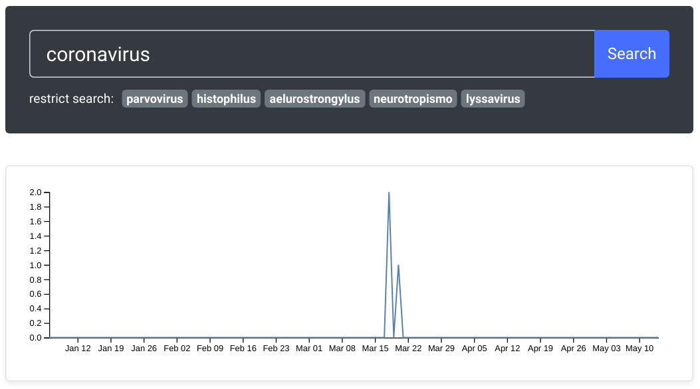

# State Logs Processing (SLP)
[](https://travis-ci.com/cidacslab/covid19-diarios-oficiais)



## Goal of the project

In Brazil,
certain decisions taken by the government have to be oficially published.
In most cases this is done daily.
Cities, States, and the Federal government have to do it.
They must publish a document called "official register".
Keeping track of the federal official register is hard task.
To follow all 27 states, let alone 5570 cities in Brazil is fairly unfeasible.
The goal of this project is to develop a system that allows the user 
to search daily logs of each of the 27 states
using extraction rules or simple terms.

## How to run

Navigate to `code` folder and inside it type:

```
sudo docker build -f Dockerfile -t "cidacslab/slp:latest" .
sudo docker run -it -p 7777:5000 "cidacslab/slp:latest" python application.py
```

The first command will build the docker image.
The second will launch a webserver using port `7777`.

Type `http://localhost:7777/` on your Web browser.

### Acknowledgments

This project would not happen without the help of [@myedibleenso](https://github.com/myedibleenso).
